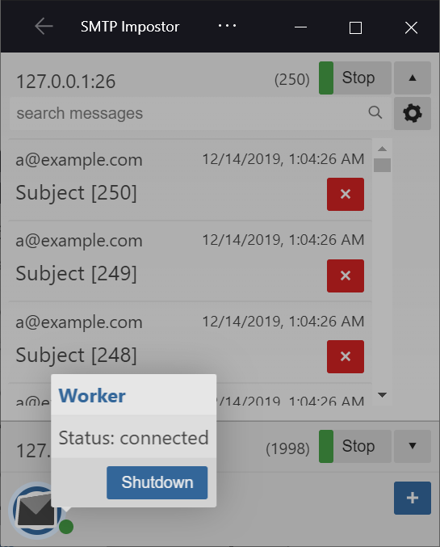

# smtp-impostor v3.0

Fake SMTP server for developers - Catches emails sent via SMTP an puts them in a temp directory so you don't send people emails by accident



## in development, but works now

worker written in c# [dotnet core 3](https://dotnet.microsoft.com/download/dotnet-core/3.0), the ui (wip) will need [npm](https://nodejs.org) to build

### available scripts ```/.deploy```

  1. ```/.deploy/build.ps1``` builds worker project and publishes to ```/dist```.
     - Run the SMTP.Impostor.Worker.exe to run as a console
  2. ```/.deploy/install.ps1``` builds and installs as windows service
     - requires admin elevation and request user to run service as
  3. ```/.deploy/uninstall.ps1``` uninstalls the installed service
     - requires admin elevation

```{id}.eml``` files are dropped in ```{Drive}\Users\{User}\AppData\Local\Temp\Impostor\127.0.0.1_25```, windows 10 mail app can open them, otherwise you will need [thunderbird](https://www.thunderbird.net) or [outlook desktop](https://products.office.com/en-gb/outlook/email-and-calendar-software-microsoft-outlook)


once running the admin ui (wip) is available through a browser ```https://localhost:62525```, you can install it as a web app if you are using a browser that supports [progressive web apps (pwa)](https://en.wikipedia.org/wiki/Progressive_web_applications)

### using in unit tests

```
[TestMethod]
public void catch_emails_with_impostor()

  var hostSettings = new SMTPImpostorHostSettings(
            ip: "127.0.0.1",
            port: 52525);

  SMTPImpostorMessage messages = null;

  using var host = GetSMTPImpostorHost(hostSettings);
  using var events = host.Events
          .OfType<SMTPImpostorMessageReceivedEvent>()
          .Subscribe(e => message = e.Data);

  using var client = new SmtpClient(hostSettings.HostName, hostSettings.Port);
  using var mailMessage = new MailMessage
  {
      From = new MailAddress("a@example.com"),
      Subject = "SUBJECT",
      Body = "SOME CONTENT\nSOME CONTENT\nSOME CONTENT\nSOME CONTENT\n"
  };
  mailMessage.To.Add("b@example.com");

  client.Send(mailMessage);

  Assert.IsFalse(string.IsNullOrWhiteSpace(message.Id));
  Assert.AreNotEqual(0, message.Headers);
  Assert.IsFalse(string.IsNullOrWhiteSpace(message.Subject));
}

ISMTPImpostorHost GetSMTPImpostorHost(
    SMTPImpostorHostSettings hostSettings)
{
    var services = new ServiceCollection()
        .AddLogging()
        .AddSMTPImpostor()
        .BuildServiceProvider();

    var host = services.GetRequiredService<ISMTPImpostorHost>();
    host.Configure(hostSettings);
    host.Start();

    return host;
}
```
